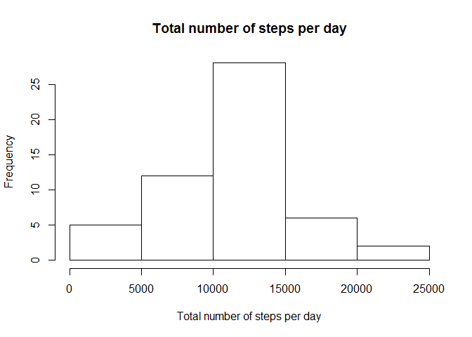
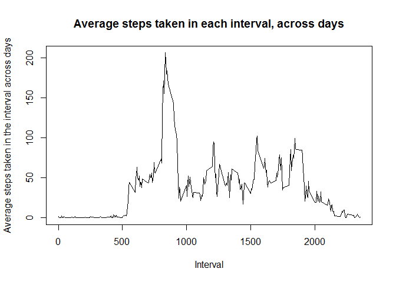
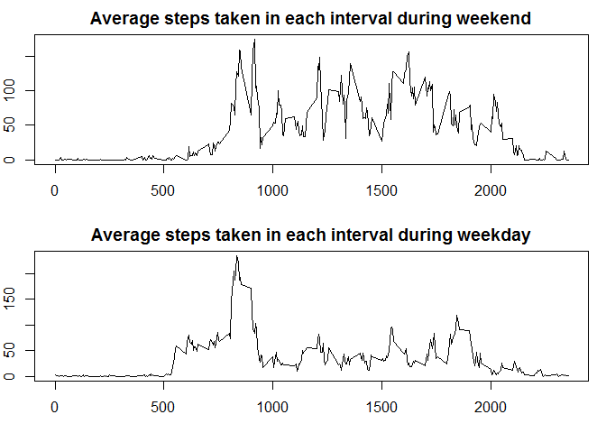

Download and load the data
--------------------------

    download.file("https://d396qusza40orc.cloudfront.net/repdata%2Fdata%2Factivity.zip", "./zipped_data")
    unzip("./zipped_data")
    activity = read.csv("activity.csv")
    activity$date <- as.Date(as.character(activity$date), "%Y-%m-%d")

Total Number of steps taken per day
-----------------------------------

    total_steps_per_day <- tapply(activity$steps, activity$date, sum)
    hist(total_steps_per_day, xlab = "Total number of steps per day", main = "Total number of steps per day")

    mean_total_steps <- mean(total_steps_per_day, na.rm=TRUE)
    median_total_steps <- median(total_steps_per_day, na.rm = TRUE)

The mean of total number of steps is 1.076618910^{4} and the median is
10765.

Average Daily Activity Pattern
------------------------------

    avg_steps_per_interval <- tapply(activity$steps, activity$interval, mean, na.rm=TRUE)
    plot(x=unique(activity$interval), y=avg_steps_per_interval, type="l", xlab = "Interval", ylab = "Average steps taken in the interval across days", main="Average steps taken in each interval, across days")

    index_max <- which.max(avg_steps_per_interval)
    max_steps_interval <- unique(activity$interval)[index_max]

The interval with maximum average steps across days is 835.

Imputing missing values
-----------------------

    num_NA <- sum(is.na(activity$steps))

The number of rows with missing value is 2304.

These missing values can be substituted using the average number of
steps taken during that interval across days.

    imputed_values <- data.frame(interval=unique(activity$interval), Avg_steps = avg_steps_per_interval)
    library(dplyr)

    ## 
    ## Attaching package: 'dplyr'

    ## The following objects are masked from 'package:stats':
    ## 
    ##     filter, lag

    ## The following objects are masked from 'package:base':
    ## 
    ##     intersect, setdiff, setequal, union

    imputed_activity_data <- merge(activity, imputed_values, by="interval")
    imputed_activity_data$steps[is.na(imputed_activity_data$steps)] <- imputed_activity_data$Avg_steps[is.na(imputed_activity_data$steps)]
    new_total_steps_per_day <- tapply(imputed_activity_data$steps, imputed_activity_data$date, sum)
    hist(new_total_steps_per_day, xlab = "Total number of steps per day", main = "Total number of steps per day")

    new_mean_total_steps <- mean(new_total_steps_per_day, na.rm=TRUE)
    new_median_total_steps <- median(new_total_steps_per_day, na.rm = TRUE)

The new mean of total steps taken is 1.076618910^{4} and the new median
is 1.076618910^{4}. The numbers are comparable with the original mean
and median. Hence the imputation has not introduced any bias.

Comparing activity patterns in weekdays and weekends
----------------------------------------------------

    activity$type <- ifelse(weekdays(activity$date)=="Saturday" | weekdays(activity$date)=="Sunday", "weekend", "weekday")
    weekend_data <- subset(activity, type=="weekend")
    weekday_data <- subset(activity, type=="weekday")
    avg_steps_weekend <- tapply(weekend_data$steps, weekend_data$interval, mean, na.rm=TRUE)
    avg_steps_weekday <- tapply(weekday_data$steps, weekday_data$interval, mean, na.rm=TRUE)
    par(mfrow=c(2,1), mar=c(3,2,2,1))
    plot(x=unique(activity$interval), y=avg_steps_weekend, type="l", xlab = "Interval", ylab = "Average steps", main="Average steps taken in each interval during weekend")
    plot(x=unique(activity$interval), y=avg_steps_weekday, type="l", xlab = "Interval", ylab = "Average steps", main="Average steps taken in each interval during weekday")

